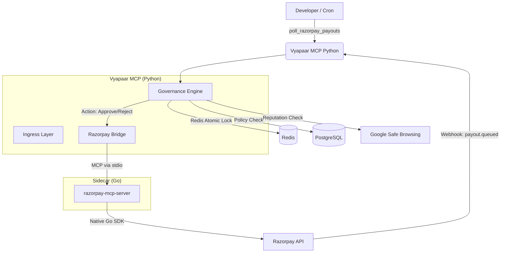

# Project Checkpoint: Vyapaar MCP

> *Internal prototype record*

**Date:** 2026-02-11
**Status:** Feature Complete (Hybrid Architecture)
**Tests:** 52/52 PASSED (including Go Bridge integration)

---

## 🚀 Executive Summary

Vyapaar MCP has evolved from a pure webhook-based governance server to a **Hybrid Architecture** (v4.0.0). It now includes a **Go MCP Sidecar** that provides native connectivity to the Razorpay API, enabling both **active polling** and **event-driven** operations.

This architecture solves the "local development gap" — no tunnels or ngrok required for development. The Python server simply asks the Go binary to fetch payouts, runs them through the governance engine, and approves/rejects them.

---

## 🏗 Architecture (v4.0.0)



### Key Components

1.  **Python Core (`src/vyapaar_mcp/`)**:
    *   **Governance Engine:** The brain. Checks budgets, policies, and reputation.
    *   **Ingress:** Handles both Webhooks (HMAC verified) and Polling.
    *   **Bridge (`src/ingress/razorpay_bridge.py`):** Spawns the Go binary and speaks MCP protocol over stdio.

2.  **Go Sidecar (`bin/razorpay-mcp-server`)**:
    *   Built from `vendor/razorpay-mcp-server` (Official MIT Repo).
    *   Provides **42 native Razorpay tools** (Payouts, Payments, Orders, etc.).
    *   Handles low-level API auth and transport.

---

## ✅ Progress Report

| Feature | Status | Notes |
|:---|:---|:---|
| **Webhook Ingress** | ✅ Done | Signature verification, idempotency, model parsing works. |
| **Governance Engine** | ✅ Done | Redis atomic locking, Postgres policies, domain blocking. |
| **Reputation System** | ✅ Done | Google Safe Browsing v4 integration + Redis caching. |
| **Go Integration** | ✅ Done | **Major addition.** Python bridge spawns Go binary successfully. |
| **Polling Mode** | ✅ Done | `poll_razorpay_payouts` tool fetches and processes payouts. |
| **Tests** | ✅ Done | **52/52 passing.** Full coverage including mocking. |
| **Scripts** | ✅ Done | `seed_policies.py` and `simulate_webhook.py` created. |

---

## 🛠 Handover Instructions (How to Continue)

### 1. Build the Go Binary (One-time)
If the binary is missing or you change the vendor code:
```bash
cd vendor/razorpay-mcp-server
go build -o ../../bin/razorpay-mcp-server ./cmd/razorpay-mcp-server
cd ../..
```

### 2. Run the Server
```bash
# Ensure services are up
docker compose up -d redis postgres

# Run the MCP server
PYTHONPATH=src uv run mcp run src/vyapaar_mcp/server.py
```

### 3. Run the Tests
```bash
# Run full suite
PYTHONPATH=src uv run pytest tests/ -v

# Run just the demo script
PYTHONPATH=src python scripts/simulate_webhook.py
```

### 4. Next Steps / Remaining Work
*   **Slack Integration:** The `SLACK_BOT_TOKEN` is in `.env`, but the code validation logic for Slack approval requests is "mocked" in the spec but needs final wiring in `src/egress`.
*   **Cron Job:** Automation for `poll_razorpay_payouts` (currently manual tool call).
*   **Audit Dashboard:** A simple frontend or CLI for `get_audit_log` would be nice.

---

**Artifacts Locations:**
*   Spec: `SPEC.md`
*   Source: `src/vyapaar_mcp/`
*   Tests: `tests/`
*   Scripts: `scripts/`
*   Go Vendor: `vendor/razorpay-mcp-server/`
*   Go Binary: `bin/razorpay-mcp-server`
